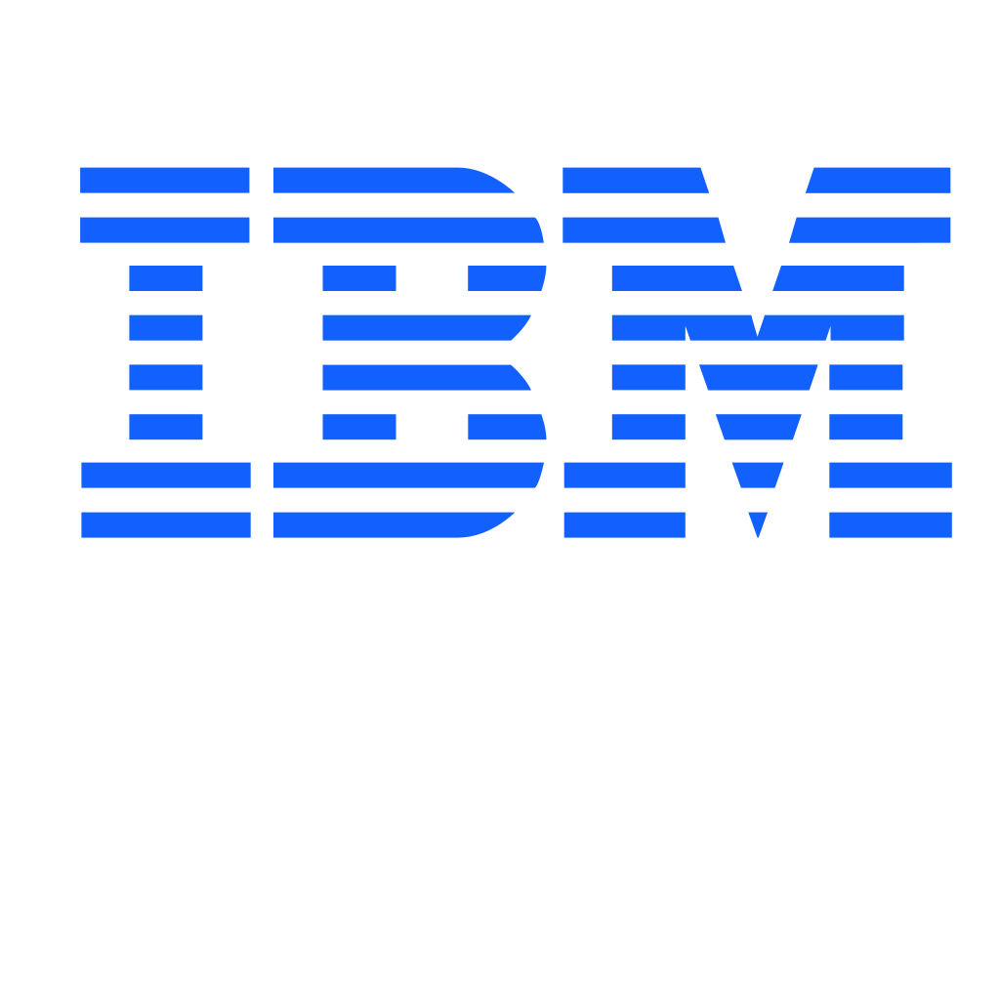

# Hi there, I am Ali👋👨‍💻

## About Me 🙋‍♂️

🧑‍🎓 **BS in Computer Science.**  
📈 **Data Science** and **Machine-Learning** Enthusiast. 
🖥️ **Passionate Technologist** and **Software Developer.** 
📚 **Self-motivated** and **Quick Learner**. 

## Tech Stack

### Languages:

### Frameworks:

|Web-Development|AI & ML|
|:---:|:---:|
|| |

### Tools & Techniques:

|IDEs|DBMS|
|:---:|:---:|
| | |

|Cloud|Other Tools|
|:---:|:---:|
| | |

<!--
**AliAlmuhaysin/AliAlmuhaysin** is a ✨ _special_ ✨ repository because its `README.md` (this file) appears on your GitHub profile.
##
Here are some ideas to get you started:

- 🔭 I’m currently working on ...
- 🌱 I’m currently learning ...
- 👯 I’m looking to collaborate on ...
- 🤔 I’m looking for help with ...
- 💬 Ask me about ...
- 📫 How to reach me: ...
- 😄 Pronouns: ...
- ⚡ Fun fact: ...
-->